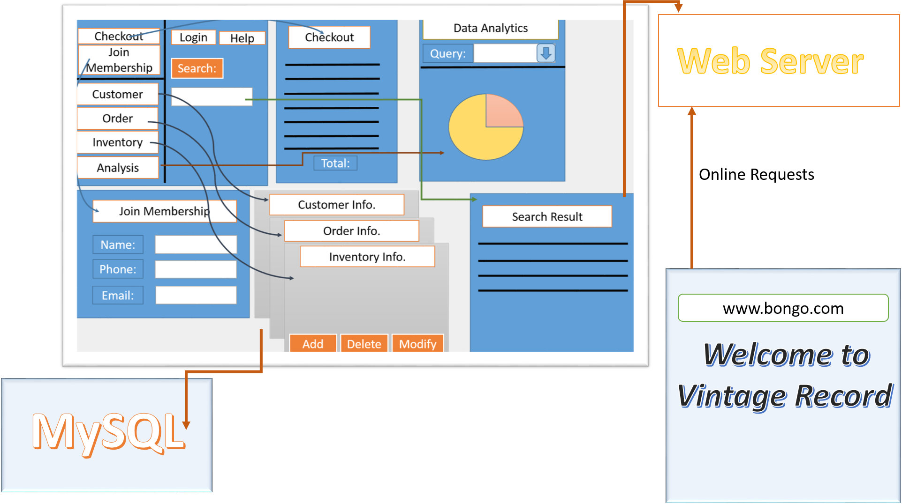

# AutoTrackSystem
Object-Oriented Analysis and Design Course Project:   
-  Built the model using UML Diagrams and completed SRS based on functional & non-functional requirements
-  Implemented application features using Swing for visualization and MySQL as backend database 
-  Created a dashboard that allows users to query information and generate reports through interactive menu

  ```
  
  ```
